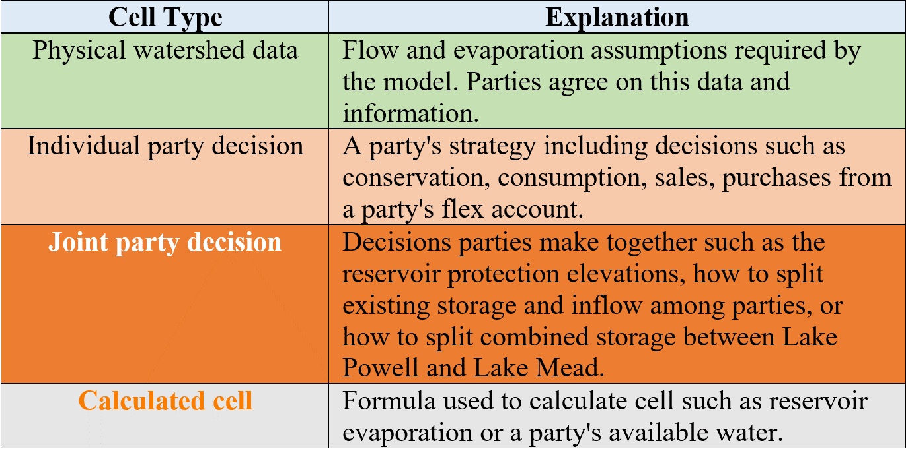
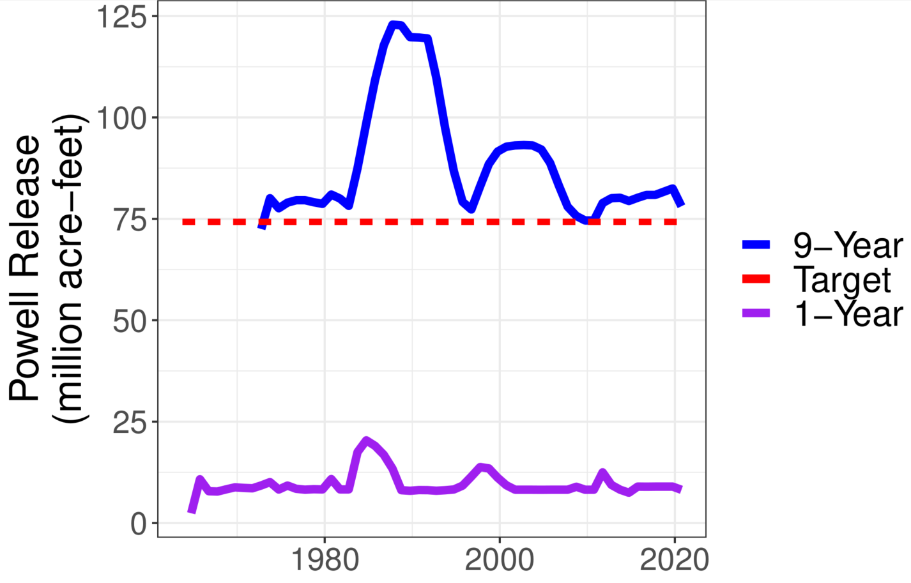
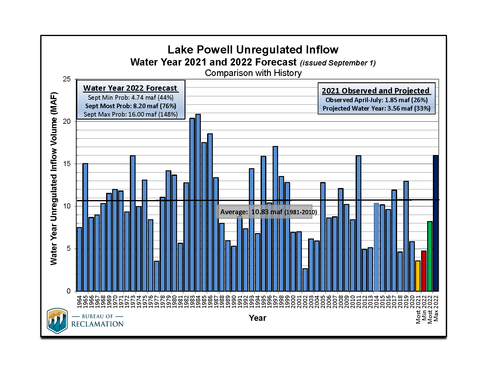
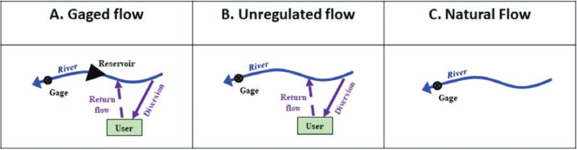
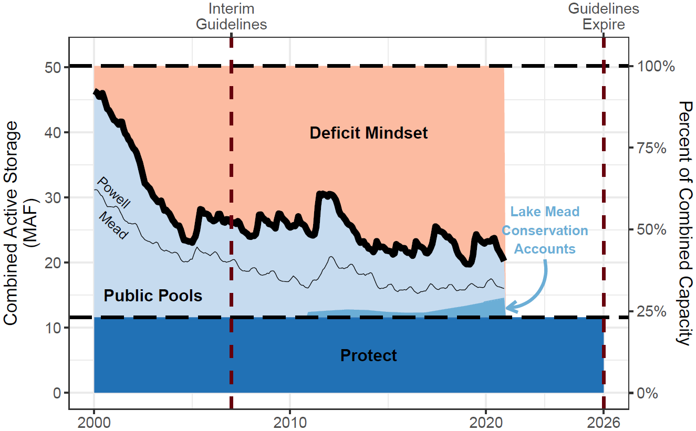
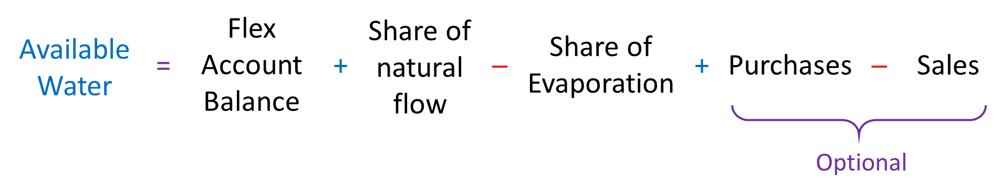
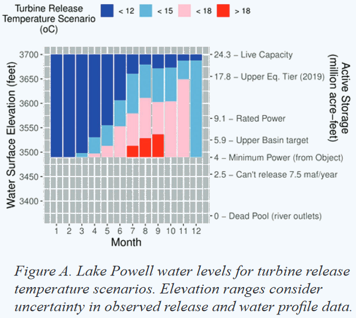
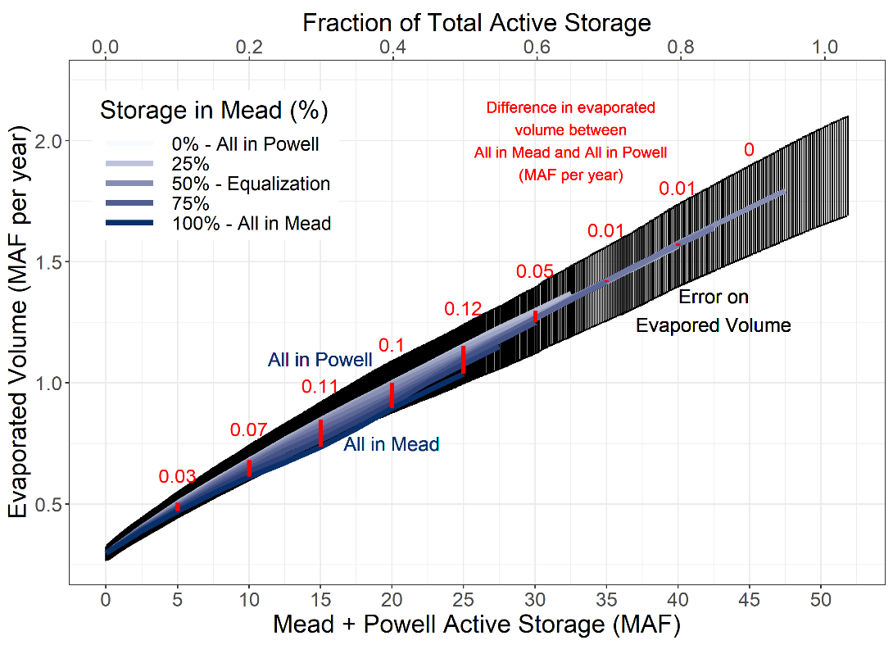
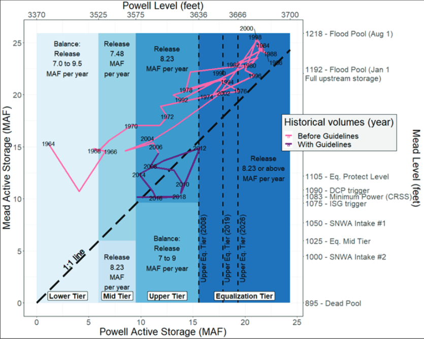

**Synchronous Model Guidance**

**Flex Accounting for a Combined Lake Powell-Lake Mead System**

David E. Rosenberg \| Utah State University \|
[david.rosenberg@usu.edu](mailto:david.rosenberg@usu.edu) \| @WaterModeler

October 5, 2021

I**ntroduction**

This document supports participants to use the synchronous model for a combined
Lake Powell-Lake Mead system (Rosenberg, 2021d). Synchronous means multiple
participants connect to the same cloud model and enter individual water
conservation and consumption choices and group decisions as model time
progresses year-by-year. The document provides context information for each
individual and group choice and explains how choices build on existing Colorado
River management (Appendix A). The document also suggest potential values to
enter.

Find quick links to support information (the sections of this document) in the
Model file, *Master* worksheet, Column N.

Get Started

Follow the Setup instructions in Box 1.

The rest of the document provides guidance on the steps to play.

# 1. Assign Parties, Person playing, and Strategies

Five parties and one shared, reserve account derive standing from the 1922
Colorado River Compact, U.S.-Mexico Treaty, subsequent Minutes, Upper and Lower
Basin drought contingency plan, and desire to include more parties (Table
1)(1922; IBWC, 2021; USBR, 2019; USBR, 2020).

**Table 1. Parties, Reason(s) to include in model, and Potential Strategies**

| **Party**            |                                                                                     | **Potential Strategy(s)**                                                                                                                                                                                                                                                                             |
|----------------------|-------------------------------------------------------------------------------------|-------------------------------------------------------------------------------------------------------------------------------------------------------------------------------------------------------------------------------------------------------------------------------------------------------|
| Upper Basin          | Article II(c to g) of the Colorado River Compact (1922).                            | Continue to consume \~ 4.0 maf/year. This is historical consumptive use minus Lake Powell Evaporation. Sell some water, get paid to conserve, and prepare for shortage and curtailment (Rosenberg, 2021e).                                                                                            |
| Lower Basin          | Article II(c to g) of the 1922 Colorado River Compact (1922).                       | Continue mandatory conservation and cutback from 7.5 maf per year as Lake Mead level declines (USBR, 2019). See cutback schedule in *MandatoryConservation* sheet. Buy water from other parties to reduce mandatory conservation or save some water for future years.                                 |
| Mexico               | 1944 U.S.-Mexico Treaty and subsequent Minutes                                      | Continue mandatory conservation and cutback from 1.5 maf per year as Lake Mead levels decline (IBWC, 2021). See *MandatoryConservation* sheet. Conserve additional water beyond mandatory targets. Sell some water to other parties to gain money to build non-water projects.                        |
| Colorado River Delta | Section VIII of Minute 323 (IBWC, 2021)                                             | Save until have enough water for a 0.06 maf pulse flood every few years. Save until have enough water for a longer duration 0.08 maf pulse flood. Scientists are still figuring our the ecological and other benefits of 0.08 or 0.06 maf pulse flood. Buy water and make more frequent pulse floods. |
| First Nations        | Include more parties (USBR, 2020) Tribal water study (Ten Tribes Partnership, 2018) | Develop and use 2.0 maf per year of rights. Lease undeveloped water until use. Save water for future use.                                                                                                                                                                                             |
| Shared, Reserve      | Protect Lake Powell and Lake Mead elevations of 3,525 and 1,020 feet (USBR, 2019)   | Maintain combined protection volume (11.6 maf). Account managed by consensus of all parties. Assume parties do not agree on releases, so no releases, steady storage. Transfer some water without payment to party in need.                                                                           |

Each participant can play one or more roles.

Representatives of individual states — e.g., Utah, Wyoming, Colorado, and New
Mexico in the Upper Basin — can team up to role play a party like the Upper
Basin. When teaming, draw on prior water sharing agreements such as an Upper
Basin Compact where parties share water in specified percentages (Carson et al.,
1948).

## 1A. Explain cell types

Four model cell types are defined by fill color (Table 2).

Table 2. Model Cell Types

## 1B. Make Assumptions

(i) The evaporation rates for Lake Powell and Lake Mead are taken as the
midpoint within reported ranges of measurements (Table 3)(Schmidt et al., 2016).
Evaporation rates for Lake Mead are presently measured and more reliable than
Lake Powell. Lake Powell evaporation rates have not been measured in decades. A
sensitivity analysis found that the lower and upper bounds on Lake Mead
evaporation rates for a five year study for Lake Mead draw down saw variations
of 0.25 maf or less in Lake Mead storage volume (Rosenberg, 2021a).

Reservoir evaporation rates (feet per year)

| **Reservoir** | **Midpoint** | **Range** |
|---------------|--------------|-----------|
| Powell        | 5.7          | 4.9 – 6.5 |
| Mead          | 6.0          | 5.5 – 6.4 |

(ii) The **start storage** is taken from data portals (USBR, 2021b; USBR,
2021c). Text in Column D lists the date.

(iii) The **protection elevations** of 3,525 feet for Lake Powell and 1,020 feet
for Lake Mead are defined in the Upper and Lower Basin Drought Contingency Plans
(USBR, 2019). As the reservoirs approach the protection levels, the plans state
the parties will consult with the Federal Government to stabilize and prevent
the reservoirs from falling below these levels. To stabilize, the parties will
need to make reservoir releases plus evaporation less than inflow (Rosenberg,
2021a).

(iv) The **protection volumes** associated with the Lake Powell and Lake Mead
protection elevations become the starting balance for the shared, reserve
account.

Participants can enter lower protection levels and volumes than the default
values. Lowering will reduce hydropower generation at Glen Canyon Dam and Hoover
Dam. Lowering will also raise the temperature of water in Lake Powell, raise
Glen Canyon Dam release water temperature, and pressure the native, endangered
fish populations of the Grand Canyon. With warmer release water temperatures,
non-native fish outcompete the native fish. Colorado River managers recommend to
keep the default protection levels for now. Participants can also jointly lower
the protection volume later during each year of model time.

(v) **Prior 9 year Lake Powell release** is 78.1 maf and is the release measured
through Glen Canyon Dam from 2012 to 2021 (Figure 1).

(vi) **Prior 9-year Paria River flow** is 0.17 maf and measured just before the
confluence with the Colorado River at Lee Ferry. We care about the 9-year Lake
Powel release and Paria River flow because these volumes tell us how much the
Upper Basin must deliver in the next 10th year (1st year of the model) to meet
its 10-year delivery requirement of 82.5 maf each decade to the Lower Basin and
Mexico via article III(d) of the 1922 Colorado River Compact and 1944 US-Mexico
Treaty. Here,

82.5 maf = (7.5)(10) + (1.5/2)(10)

Where 7.5 maf is the Upper Basin’s annual delivery responsibility to the Lower
Basin, (1.5/2) is the Upper Basin’s half share of the U.S. responsibility to
Mexico, and 10 is a consecutive 10 year period.

(vii) **Delivery to meet 10-year requirement** is the 82.5 maf requirement minus
the Lake Powell Release minus the Paria flow. The Upper Basin must deliver 4.2
maf to the Lower Basin next year at Lee Ferry. The Upper Basin can keep all Lake
Powell natural flow above 4.2 maf.

1.  Lake Powell Releases

# Specify natural inflow to Lake Powell

Specify natural inflow to Lake Powell as the water in the Green, San Juan,
mainstem Colorado, and other tributaries that would flow into Lake Powell if
there were no upstream human consumptive use or reservoirs. Once a Lake Powell
natural flow is specified, the rows below populate with data.

Because future flows are uncertain, we can only specify natural inflow to Lake
Powell as a scenario of possible future flows. Specify a scenario from flows
reconstructed from the historical (1905 to 2015) or paleo (1416 to 2015) periods
(Meko et al., 2017; Prairie, 2020). See workbook tab *HydrologicScenarios* for
some flow scenarios from these periods.

Alternatively, look at the mean natural flow of low-flow sequences in the paleo
reconstructed or recent observed periods (Figure 2). For example, a 5-year
drought that started in 1580 AD had a reconstructed average flow of 9 maf per
year.

1.  Sequence-average plot of the tree-ring reconstructed flow of the Colorado
    River at Lees Ferry (Salehabadi et al., 2020).

Or include flows representative of the more recent observations. Use the
unregulated inflow tracked and projected by (USBR, 2021d)(Figure 3) and add \~3
maf. The addition represents the non-reservoir consumptive use in the Upper
Basin. Figure 4 shows how to conserve from unregulated to natural flow.

1.  Unregulated flow to Lake Powell (USBR, 2021d). Add \~ 3 maf for natural
    flow.

1.  Process to go from gaged (measured) flow to natural flow (Wheeler et al.,
    2019).

Alternatively, devise a time series of flows on your own or adapt values
year-to-year as model time progresses.

The model uses natural flow as in input because the model first credits a share
of the year’s natural flow to each party’s flex account. Then parties consume
and conserve water. Consumed water is subtracted from the account balance to
obtain the end-of-year reservoir storage.

## Intervening Grand Canyon Flow

Enter the intervening flow from the Paria, Little Colorado, and Virgin rivers
plus seeps on the Grand Canyon from Glen Canyon Dam and Lake Mead. This
intervening flow excludes Lake Powell release or other upstream consumptive use
on the rivers. A compilation of USGS gaged data from 1990 to 2020 show a mean
intervening Grand Canyon flow of 0.9 maf per year with 5-year sequences below
0.75 maf (Figure 4)(Rosenberg, 2021b). By default, the model uses an intervening
Grad Canyon flow of 0.8 maf per year.

**Figure 4. Mean Grand Canyon tributary flow (Glen Canyon Dam to Lake Mead) for
different sequence lengths.**

## Mead to Imperial Dam intervening flow

Enter the intervening flow from Hoover Dam to Imperial dam. By default, this
intervening flow is 0.2 maf per year and was estimated from the natural flow
data set below Hoover Dam (Prairie, 2020).

## Havasu/Parker evaporation and evapotranspiration

This value results evaporation from Lakes Havasu and Parker and the
evapotranspiration of riverbank vegetation from Hoover Dam down to Lake Havasu.
A default value of 0.6 maf per year is used and represents the value used in
Lake Mead accounting. Find annual estimates of the Havasu/Parker evaporations
and evapotranspiration from 1995 to 2014 at USBR (2021a).

# Split existing reservoir storage among parties (year 1 only)

Split the starting combined reservoir storage (Figure 5) entered in Section 1B
among the parties. These assignments are joint party decisions. There are many
possibilities. Below, the default splits apply Interim Guidelines Intentionally
Created Surplus (ICS) accounts, the Lower and Upper Basin drought contingency
plans and the Minute 323 to the U.S.-Mexico Treaty (IBWC, 2021; USBR, 2019).

-   Assign the 11.6 maf protection volume to the shared, reserve account (5.9
    maf from Lake Powell plus 5.7 maf from Lake Mead).

-   Assign the 0.17 maf in Mexico’s Lake Mead conservation account to Mexico
    (USBR, 2021a).

-   Assign the 2.8 maf balance in Lower Basin Lake Mead conservation (ICS)
    accounts to the Lower Basin.

-   Assign the remaining Lake Mead storage to the Lower Basin.

-   Assign the remaining storage in Lake Powell to the Upper Basin.

-   In these assignments, the Colorado River Delta and First Nations do not get
    any storage. In actuality, the parties will

1.  Assign combined Lake Powell and Lake Mead storage (left) to flex accounts
    (right).

## Begin of year reservoir storage

In year, beginning of year reservoir storage is the Lake Powell and Lake Mead
volumes specified in Section 1B.

In subsequent years, the Lake Powell and Lake Mead storage volumes are the
volumes decided by parties at the end of the prior year.

## Calculate Powell + Mead Evaporation

Reservoir evaporation volume is the product of (i) annual evaporation rate (see
Section 1B), and the lake surface areas associated with the current reservoir
volumes. Find the Elevation-Storage-Area relationships on the
*Powell-Elevation-Area* and *Mead-Elevation-Area* worksheets (far right). Data
were download from the Colorado River Simulation System (CRSS) model (Wheeler et
al., 2019; Zagona et al., 2001).

The combined reservoir evaporation is divided among flex accounts in proportion
to the flex account balance (Equation 1, evaporation terms in maf per year,
balance and storage terms in maf).

For example, if the combined evaporation is 1.0 maf and Upper Basin has 10% of
the combined storage, then the Upper Basin is assigned 10% of the combined
evaporation or 0.1 maf that year.

## Calculate Mexico Water Allocation

Mexico’s water allocation is its 1.5 maf per year treaty amount minus mandatory
conservation volumes specified in Minutes 319 and 323 for declining Lake Mead
levels (IBWC, 2021). The *MandatoryConservation* sheet shows the conservation
schedule.

# Split combined natural inflow among parties

Split the combined natural inflow – natural inflow to Lake Powell, plus
intervening Grand Canyon inflow, plus Mead to Imperial Dam intervening inflow,
minus Havasu / Parker evaporation and ET – among accounts. This split is a
political decision and Table 4 shows one way to split that draws on existing
operations.

Assign inflow to parties

| **Party**            | **Volume (MCM)**             | **Comment**                                                                                                                           | **Existing Operations**                |
|----------------------|------------------------------|---------------------------------------------------------------------------------------------------------------------------------------|----------------------------------------|
| Shared, Reserve      | Varies by Evap.              | Assign the share of evaporation volume so inflow equals outflow (evaporation) and the account balance stays steady.                   | Drought Contingency Plans (USBR, 2019) |
| Colorado River Delta | 0.016                        | Is 67% of the 9-year, 0.21 maf volume pledged by the U.S. and Mexico.                                                                 | Minute 323 (IBWC, 2021)                |
| Mexico               | 1.5 – mandatory conservation | Mandatory conservation volumes increase as Lake Mead level’s decreases                                                                | Minutes 319 and 323 (IBWC, 2021)       |
| Lower Basin          | 7.5                          | All remaining Grand Canyon tributary and Mead to Imperial natural flow plus smaller of remaining Lake Powell natural flow or 7.5 maf. | 1922 Compact Article III(d)            |
| Upper Basin          | Remain                       | Remaining Lake Powell natural flow.                                                                                                   | 1922 Compact Article III(d)            |

**Additional notes:**

-   In year 1, the Delivery to meet 10-year requirement (see Section 1B) is
    assigned to the Lower Basin. Then, remaining natural flow to Lake Powell is
    assigned to the Upper Basin. This assignment makes the 10-year delivery to
    the Lower Basin and Mexico become 82.5 maf.

-   In Years 2 and higher, the first 8.23 maf of Lake Powell natural flow is
    assigned to Mexico and the Lower Basin. Any remaining natural flow goes to
    the Upper Basin.

# Player Dashboards – Conserve, Consume, and Trade

Each player has a dashboard where they can trade, conserve, and consume their
available water (Figure 6). Within their dashboard, A participant can:

1.  Upper Basin Dashboard annotated. A Lake Powell natural flow of 9 maf gives
    the Upper Basin 5.7 maf of available water to sell or consume.

-   Purchase or sell water from other player(s) with compensation.

-   Purchases and sales must include at least one other participant so the net
    trade volume for all players is zero.

-   Monitor their available water.

|  | (Eq. 1) |
|-------------------------------------------------|---------|

-   Purchases add to the available water balance and sales lower the available
    water balance.

To calculate compensation for trades, multiply the purchase or sell volume in
maf by the price in \$ per acre-foot. Table 5 shows rough Colorado River water
prices.

-   For example, a purchase of 0.5 maf at \$500 per acre-foot is (0.5)(500) =
    \$250 million.

-   If a party buys 0.5 maf at \$500 per acre-foot from one party and 0.2 maf at
    \$1,200 per acre-foot from a second party, enter the compensation formula
    as:

Purchase Cost = (0.5)(500) + (0.2)(1,200) = \$850 million.

Rough Colorado River water prices

| Description                                     | Price (\$/acre-foot) |
|-------------------------------------------------|----------------------|
| Low value agriculture – Upper Basin             | \$300 - \$500        |
| Agriculture - Lower Basin                       | \$700 - \$1,000      |
| Desalination in the Sea of Cortez (James, 2021) | \$2,000              |

Withdraws and consumptive use must stay within the available water. The withdraw
cell fill will turn red when the withdraw exceeds the available water. No
withdrawing more money than is in your bank account!

The dashboards repeat for the other parties.

## Shared, Reserve Dashboard

The dashboard for the shared, reserve account is orange fill – all parties must
agree to a purchase or sale (Figure 7).

1.  All Shared, Reserve Account choices are a joint decision by all parties.

The current recommendation is keep the shared, reserve account balance steady –
no sales or gifts to parties in distress.

Selling or gifting water from the shared, reserve account to other parties will
lower Lake Powell and/or Lake Mead levels:

-   Reduce the head available for hydropower generation, and speed the time that
    reservoirs reach their minimum power pools (where they can no longer
    generate energy). When energy generation declines, Lake Powell and Lake Mead
    energy producers must go on the spot energy market to purchase the energy
    shortfall. The synchronous model does not quantify the impacts of reduced
    hydropower generation.

-   Reduce storage in Lake Powell, heat the water temperature of Lake Powell
    storage (less stratification), increase the release water temperature, and
    make the native, endangered fish of the Grand Canyon more susceptible to
    prey by non-native fish. The worksheet *PowellReleaseTemperature* provides a
    table and figure of the impacts on fish of less water storage in Lake
    Powell.

Both impacts will depend on how combined storage is split between Lake Powell
and Lake Mead (see next section).

# Summary of Player Actions

Shows player actions grouped by Purchases and Sales, Account Withdraws, and
Account end-of-year balances. These groupings can help see whether sales
balanced purchases and also overall water consumption for the year.

## Combined Storage – End of Year

The combined storage – end of the year is the combined storage in Lake Powell
and Lake Mead at the end of the year after all account withdraws and consumptive
use. This volume is the sum of the end-of-year- balances in all accounts.

# Assign Combined Storage to Powell and Mead

Assign the end-of-year combined storage to Lake Powell and Lake Mead. Enter as
percent where 50% splits the combined storage equally between the two reservoirs
and 75% places more storage in Lake Powell. After entering a percent split, the
Powell and Mead storage volumes and levels populate. So does the Lake Powell
release to achieve the Powell and Mead storage, the turbine release water
temperature, and suitability of native, endangered fish of the Grand Canyon. Box
1 shows an example for 13.8 maf of combined storage.

| Impacts to assign 65% of 13.8 maf combined storage to Lake Powell                                                                                                                                                                                                                                                                                                                                                                                                                                       |                                                  |
|---------------------------------------------------------------------------------------------------------------------------------------------------------------------------------------------------------------------------------------------------------------------------------------------------------------------------------------------------------------------------------------------------------------------------------------------------------------------------------------------------------|--------------------------------------------------|
| There is 13.8 maf of combined storage. The parties assigned 65% of the storage to Lake Powell. This leaves 9.0 maf in Lake Powell and 4.8 in Lake Mead. Both Powell and Mead are above their minimum power pool elevations of 3,490 and 955 feet.  Lake Powell releases 2.8 maf to Lake Mead this year to achieve the specified storage volumes. The release water temperature is \< 18oC which may benefit the native, endangered fish of the Grand Canyon or they may face invasion from non-natives. |   |
| A release water temperature will help tailwater trout (introduced) grow and incubate. Lake Powell will need to receive 85% of combined storage to raise the storage to 11.8 maf, cool release temperatures, and increase the relative abundance of native, endangered fish.                                                                                                                                                                                                                             |                                                  |

Consider four issues to split the combined storage between the two reservoirs:

-   **Protect endangered, native fish of the Grand Canyon.** As Lake Powell
    water storage drops to the turbine release elevation of 3,490 feet (4 maf),
    the water stored in Lake Powell heats (less stratification), increases
    release water temperature through the hydropower turbines, and makes the
    native, endangered fish of the Grand Canyon more susceptible to prey by
    non-native fish (Figure 8, left). Table 6 summarizes the important Lake
    Powell elevation break points for fish. To delay these negative impacts on
    fish, managers can forego release and hydropower generation through the
    turbines and instead release water through the low elevation river outlets
    (elevation 3,370 feet; 0 maf). For example, an 18oC release through the
    river outlets requires 5.9 maf less storage than an 18oC release through
    hydropower turbines (elevation 3,600 feet on Figure 8 left plot to 3,525
    feet on right plot). This information is also presented on the
    *PowellReleaseTemperature* worksheet.

|  |  |
|-------------------------------------------------|-------------------------------------------------|

1.  Lake Powll turbine water release temperatures through the hydropower
    turbines (elevation 3,490 feet; left) and river outlets (elevation 3,370
    feet; right) for different water surface elevations (Wheeler et al., 2021).

    Effects of Summer Lake Powell Elevation on Fish

    

-   **Reduce Impacts on Hydropower Generation.** Reduced water surface elevation
    reduces hydropower generation and speeds the time that reservoirs reach
    their minimum power pools (elevations 3,490 and 955 feet in Lake Powell and
    Lake Mead) where the reservoirs can no longer generate energy. When energy
    generation declines, Lake Powell and Lake Mead energy producers must go on
    the spot energy market to purchase the energy shortfall. The synchronous
    model does not quantify the impacts of reduced hydropower generation.

-   **Reduce evaporation loss.** The combined evaporated volume changes less
    than 0.12 maf (red numbers) when preferentially storing water in Lake Mead
    or Lake Powell (Figure 9). We do not recommend to use reservoir evaporation
    as a criteria for splitting water between Lake Powell and Lake Mead.

    

1.  Combined evaporated volume changes little (red numbers) when preferrentially
    storing water in Lake Mead or Lake Powell.

-   **Current operations**. Since 2007, the current operations sought to
    equalize storage in Lake Powell and Lake Mead (enter 50%)(USBR, 2007). Prior
    to 2007, managers kept more storage in Lake Mead (Figure 10).

    

1.  Lake Powell-Lake Mead coordination rules (blue fill) and historical lake
    levels before and after the 2007 interim guidelines (pink and purple
    lines)(Wheeler et al., 2019) .

# Move to next year

Move to Step 2 Specify natural inflow to Lake Powell in the next year (next
column) after assigning the combined storage to Lake Powell and Lake Mead.

# Data, Model, and Code Availability

The data, code, and directions to generate figures in this post are available on
Github.com at Rosenberg (2021c).

# Requested Citation

David E. Rosenberg (2021). “Give Lake Mead managers more flexibility to conserve
and stop draw down to the dead pool.” Utah State University, Logan, Utah.
<https://github.com/dzeke/ColoradoRiverCoding/blob/master/BlogDrafts/3-GiveLakeMeadManagersMoreFlexibilityToConserveToStopDrawdownToDeadPool.docx>.

# References

(1922). "Colorado River Compact."
<https://www.usbr.gov/lc/region/pao/pdfiles/crcompct.pdf>. [Accessed on: October
5, 2021].

Carson, C. A., Stone, C. H., Wilson, F. E., Watson, E. H., and Bishop, L. C.
(1948). "Upper Colorado River Basin Compact." U.S. Bureau of Reclamation.
<https://www.usbr.gov/lc/region/g1000/pdfiles/ucbsnact.pdf>. [Accessed on:
September 7, 2021].

IBWC. (2021). "Minutes between the United States and Mexican Sections of the
IBWC." United States Section.
<https://www.ibwc.gov/Treaties_Minutes/Minutes.html>. [Accessed on: July 22,
2021].

James, I. (2021). "Southwest braces for water cutbacks as drought deepens along
the Colorado River." *Arizona Republic*.

Meko, D., Bigio, E., and Woodhouse, C. A. (2017). "Colorado River at Lees Ferry,
CO River (Updated Skill)." *Treeflow*.
[https://www.treeflow.info/content/upper-colorado\#field-ms-calibration-validation](https://www.treeflow.info/content/upper-colorado#field-ms-calibration-validation).

Prairie, J. (2020). "Colorado River Basin Natural Flow and Salt Data." U.S.
Bureau of Reclamation.
<https://www.usbr.gov/lc/region/g4000/NaturalFlow/current.html>.

Rosenberg, D. E. (2021a). "Adapt Lake Mead releases to inflow to give managers
more flexibility to slow reservoir draw down." Utah State University, Logan,
Utah. <https://digitalcommons.usu.edu/water_pubs/170/>.

Rosenberg, D. E. (2021b). "Colorado River Coding: Grand Canyon Intervening
Flow." GrandCanyonInterveningFlow folder.
<https://doi.org/10.5281/zenodo.5522835>.

Rosenberg, D. E. (2021c). "Colorado River Coding: Intentionally Created Surplus
for Lake Mead: Current Accounts and Next Steps." ICS folder.
<https://doi.org/10.5281/zenodo.5522835>.

Rosenberg, D. E. (2021d). "Colorado River Coding: Pilot flex accounting to
encourage more water conservation in a combined Lake Powell-Lake Mead system."
ModelMusings folder. <https://doi.org/10.5281/zenodo.5522835>.

Rosenberg, D. E. (2021e). "Invest in Farm Water Conservation to Curtail Buy and
Dry." *169*, Utah State University, Logan, Utah.
<https://digitalcommons.usu.edu/water_pubs/169/>.

Salehabadi, H., Tarboton, D., Kuhn, E., Udall, B., Wheeler, K., E.Rosenberg, D.,
Goeking, S., and Schmidt, J. C. (2020). "Stream flow and Losses of the Colorado
River in the Southern Colorado Plateau." Center for Colorado River Studies, Utah
State University, Logan, Utah.
<https://qcnr.usu.edu/coloradoriver/files/WhitePaper4.pdf>.

Schmidt, J. C., Kraft, M., Tuzlak, D., and Walker, A. (2016). "Fill Mead First:
a technical assessment." Utah State University, Logan, Utah.
<https://qcnr.usu.edu/wats/colorado_river_studies/files/documents/Fill_Mead_First_Analysis.pdf>.

Ten Tribes Partnership. (2018). "Colorado River Basin Ten Tribes Partnership
Tribal Water Study." U.S. Department of the Interior, Bureau of Reclamation, Ten
Tribes Partnership.
<https://www.usbr.gov/lc/region/programs/crbstudy/tws/finalreport.html>.

USBR. (2007). "Record of Decision: Colorado River Interim Guidelines for Lower
Basin Shortages and Coordinated Operations for Lakes Powell and Mead." U.S.
Bureau of Reclamation.
<https://www.usbr.gov/lc/region/programs/strategies/RecordofDecision.pdf>.

USBR. (2019). "Agreement Concerning Colorado River Drought Contingency
Management and Operations." U.S. Bureau of Reclamation, Washington, DC.
<https://www.usbr.gov/dcp/finaldocs.html>.

USBR. (2020). "Review of the Colorado River Interim Guidelines for Lower Basin
Shortages and Coordinated Operations for Lake Powell and Lake Mead." U.S. Bureau
of Reclamation, U.S. Department of Interior.
<https://www.usbr.gov/ColoradoRiverBasin/documents/7.D.Review_FinalReport_12-18-2020.pdf>.

USBR. (2021a). "Boulder Canyon Operations Office - Program and Activities: Water
Accounting Reports." U.S. Bureau of Reclamation.
<https://www.usbr.gov/lc/region/g4000/wtracct.html>.

USBR. (2021b). "Glen Canyon Dam, Current Status, Lake Powell Inflow Forecast."
U.S. Bureau of Reclamation. <https://www.usbr.gov/uc/water/crsp/cs/gcd.html>.

USBR. (2021c). "Lake Mead at Hoover Dam, End of Month Elevation." Lower Colorado
River Operations, U.S. Buruea of Reclamation.
<https://www.usbr.gov/lc/region/g4000/hourly/mead-elv.html>. [Accessed on:
October 5, 2021].

USBR. (2021d). "Lake Powell Unregulated Inflow."
<https://www.usbr.gov/uc/water/crsp/studies/images/PowellForecast.png>.
[Accessed on: September 28, 2021].

Wheeler, K., Kuhn, E., Bruckerhoff, L., Udall, B., Wang, J., Gilbert, L.,
Goeking, S., Kasprak, A., Mihalevich, B., Neilson, B., Salehabadi, H., and
Schmidt, J. C. (2021). "Alternative Management Paradigms for the Future of the
Colorado and Green Rivers." Center for Colorado River Studies, Utah State
University, Logan, Utah.
<https://qcnr.usu.edu/coloradoriver/files/WhitePaper6.pdf>.

Wheeler, K. G., Schmidt, J. C., and Rosenberg, D. E. (2019). "Water Resource
Modelling of the Colorado River – Present and Future Strategies." Center for
Colorado River Studies, Utah State University, Logan, Utah.
<https://qcnr.usu.edu/coloradoriver/files/WhitePaper2.pdf>.

Zagona, E. A., Fulp, T. J., Shane, R., Magee, T., and Goranflo, H. M. (2001).
"Riverware: A Generalized Tool for Complex Reservoir System Modeling." *JAWRA
Journal of the American Water Resources Association*, 37(4), 913-929.
<https://onlinelibrary.wiley.com/doi/abs/10.1111/j.1752-1688.2001.tb05522.x>.
