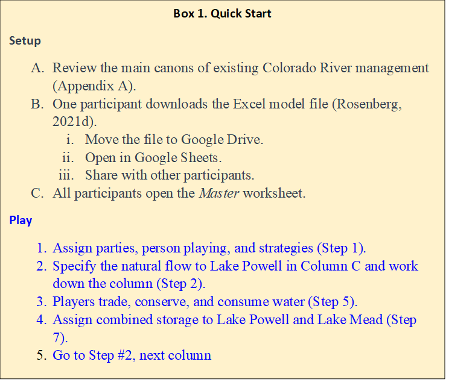
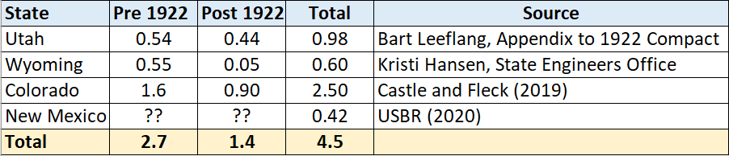
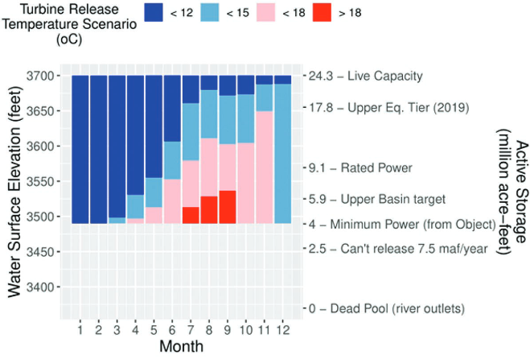
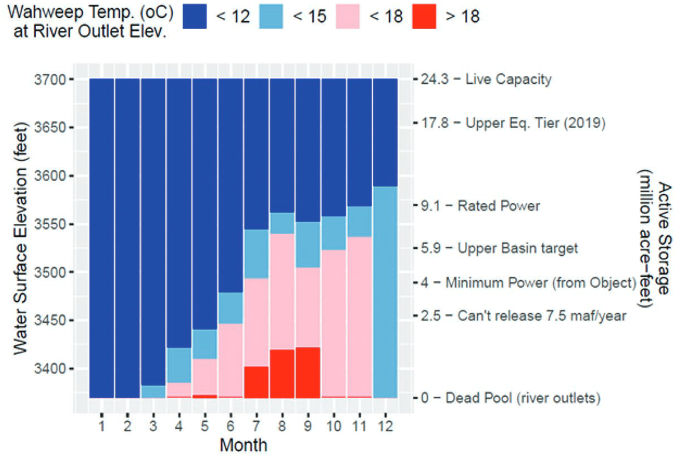
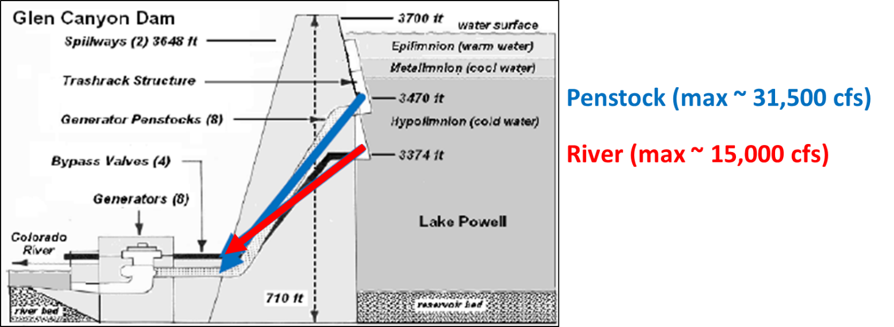

# Synchronous Model Guide

## Flex Accounting for a Combined Lake Powell-Lake Mead System

David E. Rosenberg \| Utah State University \|
[david.rosenberg@usu.edu](mailto:david.rosenberg@usu.edu) \| @WaterModeler

October 15, 2021

# I**ntroduction**

This document supports participants to use the synchronous model for a combined
Lake Powell-Lake Mead system (Rosenberg, 2021d). Synchronous means multiple
participants connect to the same cloud model and enter individual water
conservation and consumption choices and group decisions as model time
progresses year-by-year. This document provides context information for each
individual and group choice and explains how choices build on existing Colorado
River management (Appendix A). The document also suggest potential values to
enter.

Find quick links to support information (the sections of this document) in the
Model file, *Master* worksheet, Column N.

# Get Started

Follow the Setup and Play instructions in Box 1. The rest of the document
provides guidance on the steps to play.

## Types of Use

The synchronous model can be used in two modes:

1.  Synchronously by multiple people where each person plays one or more parties
    (in Google Drive).

2.  By a single person (plays all parties).

Players can explore:

-   Water conservation and consumptive use strategies.

-   Scenarios of natural flow.

-   Joint (political) decisions such as:

    -   Include more parties or stakeholders.

    -   Split existing reservoir storage among parties.

    -   Split future inflows among parties.

    -   Split the combined reservoir storage among reservoirs.

# Step 1. Assign Parties, Person playing, and Strategies

Five parties and one shared, reserve account derive standing from the 1922
Colorado River Compact, 1944 U.S.-Mexico Treaty, subsequent Minutes 319 and 323,
Upper and Lower Basin drought contingency plans, and desire to include more
parties (Table 1)(1922; IBWC, 2021; USBR, 2019; USBR, 2020).

**Table 1. Parties, Reason(s) to include in model, and Potential Strategies**

| **Party**            |                                                                                     | **Potential Strategy(s)**                                                                                                                                                                                                                                                                                                         |
|----------------------|-------------------------------------------------------------------------------------|-----------------------------------------------------------------------------------------------------------------------------------------------------------------------------------------------------------------------------------------------------------------------------------------------------------------------------------|
| Upper Basin          | Article II(c to g) of the Colorado River Compact (1922).                            | Continue to consume \~ 4.0 maf/year (historical consumptive use). 4.0 maf includes 1.1 maf of use by First Nations in the Upper Basin.  Increase consumptive use above 4.0 maf/year to fulfil aspirations to further develop. Sell some water, get paid to conserve, and prepare for shortage and curtailment (Rosenberg, 2021e). |
| Lower Basin          | Article II(c to g) of the Colorado River Compact (1922).                            | Continue mandatory conservation and cutback from 7.5 maf per year as Lake Mead level declines (USBR, 2019). See cutback schedule in *MandatoryConservation* sheet. 7.5 maf includes 0.95 maf of use by First Nations in the Lower Basin. Buy water to reduce mandatory conservation.  Save some water for future years.           |
| Mexico               | 1944 U.S.-Mexico Treaty and subsequent Minutes                                      | Continue mandatory conservation and cutback from 1.5 maf per year as Lake Mead levels decline (IBWC, 2021). See *MandatoryConservation* sheet. Conserve more water beyond mandatory targets. Sell some water to other parties to gain money to build non-water projects.                                                          |
| Colorado River Delta | Section VIII of Minute 323 (IBWC, 2021)                                             | Save until have enough water for a 0.06 maf pulse flood every few years. Save until have enough water for a longer duration 0.08 maf pulse flood. Scientists are still figuring our the ecological and other benefits of 0.08 or 0.06 maf pulse floods. Buy water and make more frequent pulse floods.                            |
| First Nations        | Include more parties (USBR, 2020) Tribal water study (Ten Tribes Partnership, 2018) | Develop and use 2.0 maf per year of rights. 1.1 maf of use by First Nations in the Upper Basin and 0.95 maf by First Nations in the Lower Basin. Lease undeveloped water. Save water for future use.                                                                                                                              |
| Shared, Reserve      | Protect Lake Powell and Lake Mead elevations of 3,525 and 1,020 feet (USBR, 2019)   | Maintain combined protection volume (11.6 maf). Account managed by consensus of all parties. Assume parties do not agree on releases, so no releases, steady account balance. Transfer some water without payment to party in need.                                                                                               |

Each participant can play one or more roles.

Representatives of individual states — e.g., Utah, Wyoming, Colorado, and New
Mexico in the Upper Basin — can team up to role play a party like the Upper
Basin. When teaming, draw on prior water sharing agreements such as an Upper
Basin Compact where parties share water in specified percentages (Carson et al.,
1948).

## 1A. Explain cell types

Four model cell types are defined by fill color (Table 2).

**Table 2. Model Cell Types**

## 1B. Make Assumptions

### **(i) Evaporation rates**

Evaporation rates for Lake Powell and Lake Mead are taken as the midpoint within
reported ranges of measurements (Table 3)(Schmidt et al., 2016). Evaporation
rates for Lake Mead are presently measured and more reliable than Lake Powell.
Lake Powell evaporation rates have not been measured in decades. A sensitivity
analysis found that the lower and upper bounds on Lake Mead evaporation rates
for a five year study for Lake Mead draw down saw variations of 0.25 maf or less
in Lake Mead storage volume (Rosenberg, 2021a).

**Table 3. Reservoir evaporation rates (feet per year)**

| **Reservoir** | **Midpoint** | **Range** |
|---------------|--------------|-----------|
| Powell        | 5.7          | 4.9 – 6.5 |
| Mead          | 6.0          | 5.5 – 6.4 |

### (ii) Start storage

Reservoir start storage is taken from data portals (USBR, 2021b; USBR, 2021c).
Text in Column D lists the date.

### (iii) Protection elevations

The reservoir protection elevations of 3,525 feet for Lake Powell and 1,020 feet
for Lake Mead are defined in the Upper and Lower Basin Drought Contingency Plans
(USBR, 2019). As the reservoirs approach the protection levels, the plans state
the parties will consult with the Federal Government to stabilize and prevent
the reservoirs from falling below these levels. To stabilize, the parties will
need to make reservoir releases plus evaporation less than inflow (Rosenberg,
2021a).

### (iv) The protection volumes

The reservoir protection volumes associated with the Lake Powell and Lake Mead
protection elevations become the starting balance for the shared, reserve
account. These volumes are calculated from the Elevation-Area-Volume curve for
the reservoir. See worksheets *Powell-Elevation-Area* and *Mead-Elevation-Area*.

Participants can enter lower protection levels and volumes than the default
values. Lowering will reduce hydropower generation at Glen Canyon Dam and Hoover
Dam. Lowering will also raise the temperature of water in Lake Powell, raise
Glen Canyon Dam release water temperature, and pressure the native, endangered
fish populations of the Grand Canyon. With warmer release water temperatures,
non-native fish outcompete the native fish. Colorado River managers recommend to
keep the default protection levels for now. Participants can also jointly lower
the protection volume later during each year of model time.

### (v) Prior 9-year Lake Powell release

Prior 9-year Lake Powell release is 78.1 maf and is the release measured through
Glen Canyon Dam from 2012 to 2021 (Figure 1).

### **(vi) Prior 9-year Paria River flow**

Prior 9-year Paria River flow is 0.17 maf and measured just before the
confluence with the Colorado River at Lee Ferry. We care about the 9-year Lake
Powel release and Paria River flow because these volumes tell us how much the
Upper Basin must deliver in the next 10th year (1st year of the model) to meet
its 10-year delivery requirement of 82.5 maf each decade to the Lower Basin and
Mexico via article III(d) of the 1922 Colorado River Compact and 1944 US-Mexico
Treaty. Here,

82.5 maf = (7.5)(10) + (1.5/2)(10)

Where 7.5 maf is the Upper Basin’s annual delivery responsibility to the Lower
Basin, (1.5/2) is the Upper Basin’s half share of the U.S. responsibility to
Mexico, and 10 is a consecutive 10 year period.

### (vii) Delivery to meet 10-year requirement

Upper Basin delivery to meet 10-year requirement is the 82.5 maf requirement
minus the Lake Powell Release minus the Paria flow. The Upper Basin must deliver
4.2 maf to the Lower Basin next year at Lee Ferry. The Upper Basin can keep all
Lake Powell natural flow above 4.2 maf.

**Figure 1. Lake Powell Releases**

### Upper Basin pre-1922 water rights

Upper Basin water rights in million acre-feet per year prior to 1922 when the
Colorado River Compact was signed (Table 4). These water rights have a seniority
date prior to the compact. In the assignment of inflow (see Step 2), these
rights are filled first ahead of the Lower Basin’s right to 75 million acre-feet
every consecutive 10-years by Article III(d) of the Compact. Presently, pre 1922
water rights for New Mexico are unknown.

The 1.9 maf per year value in the model is the 2.7 maf per year total in Table
3, plus an assumed 0.3 maf per year for New Mexico, minus 1.06 maf per year for
First Nations in the Upper Basin. This assignment assumes Upper Basin First
Nations water rights all have a priority before 1922.

**Table 4. Upper Basin pre-compact water rights (million acre-feet per year)**

# Step 2. Specify natural inflow to Lake Powell

Specify natural inflow to Lake Powell as the water in the Green, San Juan,
mainstem Colorado, and other tributaries that would flow into Lake Powell if
there were no upstream human consumptive use or reservoirs. Once a Lake Powell
natural flow is specified, the rows below populate with data.

Because future flows are uncertain, we can only specify natural inflow to Lake
Powell as a scenario of possible future flows. Specify a scenario from flows
reconstructed from the historical (1905 to 2015) or paleo (1416 to 2015) periods
(Meko et al., 2017; Prairie, 2020). See workbook tab *HydrologicScenarios* for
some flow scenarios from these periods.

Alternatively, look at the mean natural flow of low-flow sequences in the paleo
reconstructed or recent observed periods (Figure 2). For example, a 5-year
drought that started in 1580 AD had a reconstructed average flow of 9 maf per
year.

**Figure 2. Sequence-average plot of the tree-ring reconstructed flow of the
Colorado River at Lees Ferry (Salehabadi et al., 2020).**

Or include flows representative of the more recent observations. Use the
unregulated inflow tracked and projected by (USBR, 2021d)(Figure 3) and add \~3
maf. The addition represents the non-reservoir consumptive use in the Upper
Basin. Figure 4 shows how to conserve from unregulated to natural flow.

**Figure 3. Unregulated flow to Lake Powell (USBR, 2021d). Add \~ 3 maf for
natural flow.**

**Figure 4. Process to go from gaged (measured) flow to natural flow (Wheeler et
al., 2019).**

Alternatively, devise a time series of flows on your own or adapt values
year-to-year as model time progresses.

The model uses natural flow as in input because the model first credits a share
of the year’s natural flow to each party’s flex account. Then parties consume
and conserve water. Consumed water is subtracted from the account balance to
obtain the end-of-year reservoir storage.

## 2A. Intervening Grand Canyon Flow

Enter the intervening flow from the Paria, Little Colorado, and Virgin rivers
plus seeps on the Grand Canyon from Glen Canyon Dam to Lake Mead. This
intervening flow excludes Lake Powell release or other upstream consumptive use
on the rivers. A compilation of USGS gaged data from 1990 to 2020 show a mean
intervening Grand Canyon flow of 0.9 maf per year with 5-year sequences below
0.75 maf (Figure 4)(Rosenberg, 2021b). By default, the model uses an intervening
Grad Canyon flow of 0.8 maf per year.

**Figure 4. Mean Grand Canyon tributary flow (Glen Canyon Dam to Lake Mead) for
different sequence lengths.**

## 2B. Mead to Imperial Dam intervening flow

Enter the intervening flow from Hoover Dam to Imperial dam. By default, this
intervening flow is 0.2 maf per year and was estimated from the natural flow
data set below Hoover Dam (Prairie, 2020).

## 2C. Havasu/Parker evaporation and evapotranspiration

This value results evaporation from Lakes Havasu and Parker and the
evapotranspiration of riverbank vegetation from Hoover Dam down to Lake Havasu.
A default value of 0.6 maf per year is used and represents the value used in
Lake Mead accounting. Find annual estimates of the Havasu/Parker evaporations
and evapotranspiration from 1995 to 2014 at USBR (2021a).

# Step 3. Split existing reservoir storage among parties (year 1 only)

Split the starting combined reservoir storage (Figure 5) entered in Section 1B
among the parties. These assignments are joint party (political) decisions.
There are many possibilities. Here, the default values in Column B apply Interim
Guidelines Intentionally Created Surplus (ICS) accounts, the Lower and Upper
Basin drought contingency plans and the Minute 323 to the U.S.-Mexico Treaty
(IBWC, 2021; USBR, 2019).

-   Assign the 11.6 maf protection volume to the shared, reserve account. 11.6
    maf is the sum of 5.9 maf protection volume for Lake Powell plus 5.7 maf
    protection volume for Lake Mead (USBR, 2019).

-   Assign the 0.17 maf in Mexico’s Lake Mead conservation account to Mexico
    (USBR, 2021a).

-   Assign the 2.8 maf balance in Lower Basin Lake Mead conservation (ICS)
    accounts to the Lower Basin.

-   Assign the remaining Lake Mead storage to the Lower Basin.

-   Assign the remaining storage in Lake Powell to the Upper Basin.

-   In these assignments, the Colorado River Delta and First Nations do not get
    any storage.

In actuality, the parties will negotiate over a share of the existing reservoir
storage. This negotiation should be more positive for parties. Parties will get
the same or more storage water as they get with current operations. In the
current operations there are no Lake Powell storage accounts and only Lake Mead
conservation accounts for Lower Basin and Mexico.

**Figure 5. Assign combined Lake Powell and Lake Mead storage (top) to flex
accounts (bottom).**

## 3A. Begin of year reservoir storage

In Year 1 (Column C), beginning of year reservoir storage is the Lake Powell and
Lake Mead volumes specified in Section 1B.

In subsequent years (Columns D, E, …), the Lake Powell and Lake Mead storage
volumes are the volumes decided by parties at the end of the prior year.

## 3B. Calculate Powell + Mead Evaporation

Reservoir evaporation volume is the product of (i) annual evaporation rate (see
Section 1B), and the lake surface areas associated with the current reservoir
volumes. Find the Elevation-Storage-Area relationships on the
*Powell-Elevation-Area* and *Mead-Elevation-Area* worksheets (far right). Data
were download from the Colorado River Simulation System (CRSS) model (Wheeler et
al., 2019; Zagona et al., 2001).

The combined reservoir evaporation is divided among flex accounts in proportion
to the flex account balance (Equation 1, evaporation terms in maf per year,
balance and storage terms in maf).

 Equation 1

For example, if the combined evaporation is 1.0 maf and Upper Basin has 10% of
the combined storage, then the Upper Basin is assigned 10% of the combined
evaporation or 0.1 maf that year.

## 3C. Calculate Mexico Water Allocation

Mexico’s water allocation is its 1.5 maf per year treaty amount minus mandatory
conservation volumes specified in Minutes 319 and 323 for declining Lake Mead
levels (Table 5)(IBWC, 2021). The *MandatoryConservation* sheet shows the Mexico
and Lower Basin conservation schedules.

**Table 5. Mexico Mandatory Conservation under Minutes 319 and 323**

# Split combined natural inflow among parties

Split the combined natural inflow – natural inflow to Lake Powell, plus
intervening Grand Canyon inflow, plus Mead to Imperial Dam intervening inflow,
minus Havasu / Parker evaporation and ET (see Sections 2A-C) – among accounts.
This split is a joint party (political) decision. There are lots of ways to
split. Table 6 shows one way to split that draws on existing operations. In
these operations, first assign volumes to the Shared water reserve, Delta,
Mexico, and First Nations accounts (Lake Powell Natural flow up to 3.5 maf per
year). Assign the next 1.9 maf per year of Lake Powell Natural flow to Upper
Basin pre-1922 water rights (pre Compact). Assign the next 5.8 maf of Lake
Powell Natural Inflow to the Lower Basin (reduced from 7.5 maf because First
Nations already assigned 0.95 maf for uses below Glen Canyon Dam and carriage
losses for Lake Mohave/Lake Parker evaporation and evapotranspiration. Last,
assign any remaining Lake Powell natural flow to the Upper Basin.

**Table 6. Assign inflow to parties**

| **Party**            | **Volume (MCM)**                                     | **Event**                                                                                                                                                                                         | **Existing Operations**                            |
|----------------------|------------------------------------------------------|---------------------------------------------------------------------------------------------------------------------------------------------------------------------------------------------------|----------------------------------------------------|
| Shared, Reserve      | Varies by Evap.                                      | Assign share of inflow that offsets the evaporation volume for the shared, reserve account. This assignment keeps the account balance steady year to year.                                        | Drought Contingency Plans (USBR, 2019)             |
| Colorado River Delta | 0.016                                                | 0.016 maf is 67% of the 9-year, 0.21 maf volume pledged by the U.S. and Mexico.                                                                                                                   | Minute 323 (IBWC, 2021)                            |
| Mexico               | 1.5 minus mandatory conservation minus carriage loss | Mandatory conservation volumes increase as Lake Mead level’s decreases (see Section 3C). Carriage loss is Mexico’s share of Havasu/Parker Evaporation and Evapotranspiration (1.5/8.7 = 17.2%)    | 1944 Treaty, Minutes 319 and 323 (IBWC, 2021)      |
| First Nations        | 2.01 minus Lower Basin carriage loss                 | Rights of 1.06 and 0.952 maf in the Upper and Lower Basins. Excludes claimed amounts. Lower Basin carriage loss is share of Havasu/Parker Evaporation and ET in the Lower Basin (0.95/8.7 = 11%). | Tribal Water Study (Ten Tribes Partnership, 2018). |
| Lower Basin          | 7.5 minus 0.95 minus carriage loss                   | Quantified rights of 7.5 maf minus rights of First Nations in the Lower Basin minus share of Havasu/Parker Evaporation and ET ([7.5 – 0.95]/8.7 = 75.3%).                                         | 1922 Compact Article III(d)                        |
| Upper Basin          | 1.9 + Remain                                         | Pre-compact rights plus any remaining Lake Powell natural flow.                                                                                                                                   | 1922 Compact Article III(d)                        |

The volumes in Table 6 draw from the inflow sources in different amounts (Table
7). I expect it easier to assign each year’s inflow than negotiate ever larger
mandatory conservation targets.

Table 7. Assign inflow sources to parties

| **Party**                     | **Lake Powell Natural Flow** | **Grand Canyon Intervening + Mead to Imperial** |
|-------------------------------|------------------------------|-------------------------------------------------|
| Shared, Reserve               | 50%                          | 50%                                             |
| Colorado River Delta          | 50%                          | 50%                                             |
| Mexico                        | 50%                          | 50%                                             |
| First Nations                 | 1.06 maf                     | 0.95 maf                                        |
| Upper Basin (pre-1922 rights) | min(1.9, Remain)             | --                                              |
| Lower Basin                   | min(5.8, Remain)             | Remain                                          |
| Upper Basin (post 1922)       | Remain                       | --                                              |
| Havasu/Parker Evap. and ET    | --                           | 100%                                            |

The volumes in Table 6 differ from the customary accounting of first 8.23 maf of
Lake Powell Natural flow to Lower Basin plus Mexico and remaining amount to the
Upper Basin. The difference arises because:

-   Mexico, First Nations, Colorado River Delta, and Havasu/Parker evaporation
    and evapotranspiration are accounted for separately in Flex accounting.

-   Mexico’s amount is reduced by conservation under Minutes 319 and 323.

-   The Shared, Reserve account is charged a share of the combined reservoir
    evaporation.

-   Lower Basin, Mexico, and First Nations in the Lower Basin are charged
    carriage loss (Havasu/Parker evaporation and evapotranspiration).

-   1922 Pre-Compact Upper Basin water rights are given priority over the Lower
    Basin.

The present configuration is valid for Lake Powell Natural flows down to 3.7 maf
per year. Below that value, I am unclear whether to assign natural flow to First
Nations or Mexico first or to share the assignment.

# Step 5. Player Dashboards – Conserve, Consume, and Trade

Each player has a dashboard where they can trade, conserve, and consume their
available water (Figure 6). 

**Figure 6. Upper Basin Dashboard annotated. A Lake Powell natural flow of 9 maf
gives the Upper Basin 5.7 maf of available water to sell or consume. No trades
or withdraws have been entered.**

### (i) Buy or sell water from other player(s)

Enter buy amounts as positive (+) and sell amounts negative (-). These are
additions and subtractions to the party’s available water. Enter all amounts in
maf. If multiple transactions – e.g, buy 0.5 maf from Lower Basin and 0.2 maf
from Mexico -- enter as a formula: = 0.5 + 0.2

**These transactions are all temporary – for one year!**

When a buying party requires a selling party to invest financial proceeds in new
farm or urban water conservation efforts, the money stays in the local community
and the seller can make more water available in future years (Rosenberg, 2021e).

### (ii) Compensation

Enter compensation – payments for buying, receipts for sales – in \$ millions.
Enter as a formula. Multiple the sale price in \$/acre-foot by the buy or sell
volume in maf. Table 8 shows rough Colorado River water prices. Table 9 shows
example compensation for different water prices and target water volumes.

-   For example, a purchase of 0.5 maf at \$500 per acre-foot is (0.5)(500) =
    \$250 million.

-   If a party buys 0.5 maf at \$500 per acre-foot from one party and 0.2 maf at
    \$1,200 per acre-foot from a second party, the compensation formula is:

Compensation = (0.5)(500) + (0.2)(1,200) = \$850 million.

The recently proposed 500-Plus plan seeks to reduce Lower Basin water use by 0.5
maf per year. Potential compensation amounts are shown in green fill in Table 9.

**Table 8. Rough Colorado River water prices**

**Table 9. Compensation (\$ million) at different water prices (\$/acre-foot)to
purchase different target water volumes (maf)**

### (iii) Net Trade Volume all Players

Confirm the net trade volume for all players is zero. A zero balance indicates
there is a buyer for every seller.

### (iv) Available Water

Available water is the water available to a party to consume, conserve, or sell
to another party. Purchases can increase available water (Eq. 2).

|  | (Eq. 2) |
|-------------------------------------------------|---------|

### (v) Enter Withdraw within Available Water

Flex account withdraws are a party’s consumptive use. This consumptive use
occurs by parties physically withdrawing from the combined Lake Powell-Lake Mead
system at Hoover dam (Lower Basin, Mexico, or Delta), or diverting instream flow
before that flow enters the combined system (Upper Basin). In the later case,
the Upper Basin diverts the water and its flex account is deducted the
corresponding consumptive use.

Enter withdraws and consumptive use according to the strategy identified in Step
1 or modifications to that strategy based on current conditions.

The withdraw cell fill will turn red when the withdraw exceeds the available
water. No withdrawing more money than is in your bank account!

### (vi) End of Year Balance

The party’s flex account balance at the end of the year after deducting
withdraws and consumptive use. End of Year balance = Available Water – Withdraw.

## 5A. Shared, Reserve Dashboard

The dashboard for the shared, reserve account is orange fill – all parties must
agree to a purchase or sale (Figure 7).

**Figure 7. Shared, Reserve account choices are a joint decision by all
parties.**

The current recommendation is keep the shared, reserve account balance steady –
no sales or gifts to parties in distress.

Selling or gifting water from the shared, reserve account to other parties will
lower Lake Powell and/or Lake Mead levels:

-   Reduce storage in Lake Powell, heat the water temperature of Lake Powell
    storage (less stratification), increase the release water temperature, and
    push native, endangered fish of the Grand Canyon into unchartered territory
    \-- more susceptible to prey by non-native fish. Higher Lake Powell levels
    and colder releases maintain the status quo for endangered fish. The
    worksheet *PowellReleaseTemperature* provides a table and figure of the
    impacts on fish of less water storage in Lake Powell.

-   Reduce the head available for hydropower generation, and speed the time that
    reservoirs reach their minimum power pools (where they can no longer
    generate energy). When energy generation declines, Lake Powell and Lake Mead
    energy producers must go on the spot energy market to purchase the energy
    shortfall. The synchronous model does not quantify the impacts of reduced
    hydropower generation.

Both impacts will depend on how combined storage is split between Lake Powell
and Lake Mead (see next section).

# Step 6. Summary of Player Actions

Shows player actions grouped by Purchases and Sales, Account Withdraws, and
Account end-of-year balances. These groupings can help see whether sales
balanced purchases and also overall water consumption for the year.

## 6A. Combined Storage – End of Year

The combined storage – end of the year is the combined storage in Lake Powell
and Lake Mead at the end of the year after all account withdraws and consumptive
use. This volume is the sum of the end-of-year- balances in all accounts.

# Step 7. Assign Combined Storage to Powell and Mead

Assign the end-of-year combined storage to Lake Powell and Lake Mead. Enter as
percent where 50% splits the combined storage equally between the two reservoirs
and 75% places more storage in Lake Powell.

After entering a percent split, the following items will calculate:

### (i) Powell and Mead storage volumes and levels

The model uses the elevation-area-volume relationships for the reservoirs to
calculate storage level from volume. See the left and right hand side of Figure
9 for critical levels and volumes such as dead pool (0 maf storage) and minimum
power pool (penstock elevations) to avoid.

### (ii) Lake Powell release to achieve Powell and Mead storage volumes

This is the annual release from Lake Powell to achieve the specified storage
volumes in Lake Powell and Lake Mead. Compare to numbers such as 7 to 9 maf per
year that are the target of equalization releases (Figure 11)(USBR, 2007). Note
that as combined storage declines, it will become harder to achieve the 7-9 maf
targets. This Powell release is calculated as (all terms maf):

Powell Release = -[Powell end storage] + [Powell start storage] + [Powell
Natural Inflow] – [Upper Basin Consume] – [Powell Evaporation] (Equation 3)

A negative release is infeasible and means too much water is already in Lake
Mead. Specify a lower percentage in Step 7 – lower Powell end storage.

### (iii) Turbine release water temperature

The temperature of water released through the Lake Powell penstocks to generate
hydropower. This data is pulled from observations of water temperature (Wheeler
et al., 2021, Appendix 1).

### (iv) Suitability for native, endangered fish of the Grand Canyon

As release water temperature rises, push the native, endangered fish of the
Grand Canyon into unchartered territory -- become more susceptible to
competition and prey by introduced non-native fish. Colder releases preserve the
status quo. Table 10 shows the breakpoints of temperature suitability for native
fish (Wheeler et al., 2021, Appendix 1).

### (v) Suitability for tailwater trout

The tailwater trout are an introduced species, require colder water, and live in
the Colorado River reach from Glen Canyon Dam to Lee Ferry (and possibly below).
Table 10 shows the breakpoints of temperature suitability for tailwater trout
(Wheeler et al., 2021, Appendix 1).

Box 2 shows an example of the impacts of 13.8 maf of combined storage if assign
65% of that storage to lake Powell.

## 7A. Consider four issues to split the combined storage between the two reservoirs:

### (i) Preserve status quo for endangered, native fish of the Grand Canyon

As Lake Powell water storage drops to the turbine release elevation of 3,490
feet (4 maf), the water stored in Lake Powell heats (less stratification),
increases release water temperature through the hydropower turbines, and pushes
native, endangered fish of the Grand Canyon into unchartered territory -- more
susceptible to prey by non-native fish (Figure 8, left). Higher Lake Powell
levels and colder water releases preserve the status quo. Table 10 summarizes
the important Lake Powell elevation break points for fish. To delay these
negative impacts on fish, managers can forego release and hydropower generation
through the turbines and instead release water through the low elevation river
outlets (elevation 3,370 feet; 0 maf; Figure 9). For example, an 18oC release
through the river outlets requires 5.9 maf less storage than an 18oC release
through hydropower turbines (elevation 3,600 feet on Figure 9 left plot compared
to 3,525 feet on right plot). This information is also presented on the
*PowellReleaseTemperature* worksheet.

|  |  |
|-------------------------------------------------|-------------------------------------------------|

**Figure 8. Lake Powell release water temperatures through the hydropower
turbines (elevation 3,490 feet; left) and river outlets (elevation 3,370 feet;
right) for different water surface elevations (Wheeler et al., 2021).**

**Table 10. Effects of Summer Lake Powell Elevation on Fish**

Figure 9. Glen Canyon Dam river outlets (red) are \~ 100 feet below the
penstocks (blue)

### (ii) Reduce Hydropower Generation

Reduced water surface elevation reduces hydropower generation and speeds the
time that reservoirs reach their minimum power pools (elevations 3,490 and 955
feet in Lake Powell and Lake Mead) where the reservoirs can no longer generate
energy. When energy generation declines, Lake Powell and Lake Mead energy
producers must go on the spot energy market to purchase the energy shortfall.
The synchronous model does not quantify the impacts of reduced hydropower
generation.

### (iii) Reduce evaporation loss

The combined evaporated volume changes less than 0.12 maf to preferentially
store water in Lake Mead or Lake Powell (Figure 10, red numbers). These volumes
are inside the margin of error of the evaporated volumes (Figure 10, black bars)
calculated from the evaporation rates (Section 1Bi). This analysis suggests
there is no water supply or evaporation benefit to preferentially store combined
storage in Lake Powell or Lake Mead.

**Figure 10. Combined evaporated volume changes little (red numbers) to
preferentially store water in Lake Mead or Lake Powell.**

### (iv) Current operations

Since 2007, the current operations sought to equalize storage in Lake Powell and
Lake Mead (enter 50%)(USBR, 2007). Prior to 2007, managers kept more storage in
Lake Mead (Figure 11).

**Figure 11. Lake Powell-Lake Mead coordination rules (blue fill) and historical
lake levels before and after the 2007 interim guidelines (pink and purple
lines)(Wheeler et al., 2019).**

# Step 8. Move to next year

Move to next year. Move to Step 2 Specify natural inflow to Lake Powell in the
next year (next column). Repeat Steps 2 to 7 for each year.

The purpose of synchronous model is to provoke thought and discussion about
renegotiation of Lake Powell and Lake Mead operations. So continue to play years
so long as the discussion provokes new insights.

# Step 9. Finish

Congratulations. You finished! If you wish to provide feedback – things you
liked, things to improve – please send an email to david.rosenberg@usu.edu.

# Data, Model, and Code Availability

The data, code, and directions to generate figures in this post are available on
Github.com at Rosenberg (2021c).

# Requested Citation

David E. Rosenberg (2021). " Synchronous Model Guidance: Flex Accounting for a
Combined Lake Powell-Lake Mead System." Utah State University.
<https://github.com/dzeke/ColoradoRiverCoding/tree/main/ModelMusings>.

# Appendix 1. Summary of Current Colorado River Operations

The Colorado River basin has a long history. The parties do not get along. There
is much written material. This appendix summarizes key pieces and provides links
to the actual documents:

1.  [**Map**](https://www.usbr.gov/lc/images/maps/CRBSmap.jpg) shows Upper
    Basin, Lower Basin, Glen Canyon Dam/Lake Powell, Hoover Dam/Lake Mead, and
    diversions inside and outside the hydrologic basin (USBR, 2012).

2.  **Compacts, treaties, and agreements** in 1922, 1928, 1944, 1956, 1964, and
    1968 -- <https://www.usbr.gov/lc/region/g1000/lawofrvr.html>.

1.  **2007 Interim Guidelines**. Lower Basin states increase mandatory
    conservation as Lake Mead level falls from 1,075 to 1,025 feet;
    Intentionally created surplus (aka conservation) accounts in Lake Mead for
    Lower Basin states (Section 3); Equalize storage in Lake Powell and Lake
    Mead (Section 6).
    <https://www.usbr.gov/lc/region/programs/strategies/RecordofDecision.pdf>.

1.  **2012 and 2017. Minutes 319 and 323 to the 1944 US-Mexico Treaty**. Mexico
    increases mandatory conservation as Lake Mead’s level falls from 1,090 to
    1,025 feet. <https://www.ibwc.gov/Treaties_Minutes/Minutes.html>.

1.  **2018 Ten Tribes Partnership Water Study.** Quantified 2.0 million
    acre-feet (maf) rights in Upper and Lower Basins and 0.8 maf claims.
    https://www.usbr.gov/lc/region/programs/crbstudy/tws/finalreport.html.

2.  **2019 Upper Basin Drought Contingency Plan.** Protect Lake Powell elevation
    of 3,525 feet (5.9 maf). Prevent Lake Powell to fall to minimum power pool
    elevation of 3,490 feet (4.0 maf). https://www.usbr.gov/dcp/finaldocs.html.

3.  **2019 Lower Basin Drought Contingency Plan.** Increase mandatory
    conservation targets as Lake Mead’s level falls from 1,090 feet to 1,025
    feet. See current mandatory conservation schedule in (Castle and Fleck,
    2019). Protect Lake Mead from falling below elevation 1,020 feet.
    https://www.usbr.gov/dcp/finaldocs.html.

4.  **2026.** **Interim Guidelines and Drought Contingency Plans expire.**

5.  **Castle and Fleck (2019)**:

    1.  Summarize current Colorado River operations in slightly more detail than
        Box 1.

    2.  Describe what happens when the Upper Basin is unable to deliver 8.23
        million acre-feet (maf) of water per year to Lower Basin as required in
        the 1922 Compact and 1944 US-Mexico Treaty.

1.  **Kuhn and Fleck (2019)** give a well written history of Colorado River
    management. Read this piece for fun or to go in depth on a particular piece
    of management.

# References

(1922). "Colorado River Compact."
<https://www.usbr.gov/lc/region/pao/pdfiles/crcompct.pdf>. [Accessed on: October
5, 2021].

Carson, C. A., Stone, C. H., Wilson, F. E., Watson, E. H., and Bishop, L. C.
(1948). "Upper Colorado River Basin Compact." U.S. Bureau of Reclamation.
<https://www.usbr.gov/lc/region/g1000/pdfiles/ucbsnact.pdf>. [Accessed on:
September 7, 2021].

Castle, A., and Fleck, J. (2019). "The Risk of Curtailment under the Colorado
River Compact." <http://dx.doi.org/10.2139/ssrn.3483654>.

IBWC. (2021). "Minutes between the United States and Mexican Sections of the
IBWC." United States Section.
<https://www.ibwc.gov/Treaties_Minutes/Minutes.html>. [Accessed on: July 22,
2021].

James, I. (2021). "Southwest braces for water cutbacks as drought deepens along
the Colorado River." *Arizona Republic*.

Kuhn, E., and Fleck, J. (2019). *Science Be Dammed: How Ignoring Inconvenient
Science Drained the Colorado River*, University of Arizona Press.

Meko, D., Bigio, E., and Woodhouse, C. A. (2017). "Colorado River at Lees Ferry,
CO River (Updated Skill)." *Treeflow*.
[https://www.treeflow.info/content/upper-colorado\#field-ms-calibration-validation](https://www.treeflow.info/content/upper-colorado#field-ms-calibration-validation).

Prairie, J. (2020). "Colorado River Basin Natural Flow and Salt Data." U.S.
Bureau of Reclamation.
<https://www.usbr.gov/lc/region/g4000/NaturalFlow/current.html>.

Rosenberg, D. E. (2021a). "Adapt Lake Mead releases to inflow to give managers
more flexibility to slow reservoir draw down." Utah State University, Logan,
Utah. <https://digitalcommons.usu.edu/water_pubs/170/>.

Rosenberg, D. E. (2021b). "Colorado River Coding: Grand Canyon Intervening
Flow." GrandCanyonInterveningFlow folder.
<https://doi.org/10.5281/zenodo.5522835>.

Rosenberg, D. E. (2021c). "Colorado River Coding: Intentionally Created Surplus
for Lake Mead: Current Accounts and Next Steps." ICS folder.
<https://doi.org/10.5281/zenodo.5522835>.

Rosenberg, D. E. (2021d). "Colorado River Coding: Pilot flex accounting to
encourage more water conservation in a combined Lake Powell-Lake Mead system."
ModelMusings folder. <https://doi.org/10.5281/zenodo.5522835>.

Rosenberg, D. E. (2021e). "Invest in Farm Water Conservation to Curtail Buy and
Dry." *169*, Utah State University, Logan, Utah.
<https://digitalcommons.usu.edu/water_pubs/169/>.

Salehabadi, H., Tarboton, D., Kuhn, E., Udall, B., Wheeler, K., E.Rosenberg, D.,
Goeking, S., and Schmidt, J. C. (2020). "Stream flow and Losses of the Colorado
River in the Southern Colorado Plateau." Center for Colorado River Studies, Utah
State University, Logan, Utah.
<https://qcnr.usu.edu/coloradoriver/files/WhitePaper4.pdf>.

Schmidt, J. C., Kraft, M., Tuzlak, D., and Walker, A. (2016). "Fill Mead First:
a technical assessment." Utah State University, Logan, Utah.
<https://qcnr.usu.edu/wats/colorado_river_studies/files/documents/Fill_Mead_First_Analysis.pdf>.

Ten Tribes Partnership. (2018). "Colorado River Basin Ten Tribes Partnership
Tribal Water Study." U.S. Department of the Interior, Bureau of Reclamation, Ten
Tribes Partnership.
<https://www.usbr.gov/lc/region/programs/crbstudy/tws/finalreport.html>.

USBR. (2007). "Record of Decision: Colorado River Interim Guidelines for Lower
Basin Shortages and Coordinated Operations for Lakes Powell and Mead." U.S.
Bureau of Reclamation.
<https://www.usbr.gov/lc/region/programs/strategies/RecordofDecision.pdf>.

USBR. (2012). "Colorado River Basin Water Supply and Demand Study." U.S.
Department of Interior, Bureau of Reclamation, Washington, D.C.
<https://www.usbr.gov/lc/region/programs/crbstudy.html>.

USBR. (2019). "Agreement Concerning Colorado River Drought Contingency
Management and Operations." U.S. Bureau of Reclamation, Washington, DC.
<https://www.usbr.gov/dcp/finaldocs.html>.

USBR. (2020). "Review of the Colorado River Interim Guidelines for Lower Basin
Shortages and Coordinated Operations for Lake Powell and Lake Mead." U.S. Bureau
of Reclamation, U.S. Department of Interior.
<https://www.usbr.gov/ColoradoRiverBasin/documents/7.D.Review_FinalReport_12-18-2020.pdf>.

USBR. (2021a). "Boulder Canyon Operations Office - Program and Activities: Water
Accounting Reports." U.S. Bureau of Reclamation.
<https://www.usbr.gov/lc/region/g4000/wtracct.html>.

USBR. (2021b). "Glen Canyon Dam, Current Status, Lake Powell Inflow Forecast."
U.S. Bureau of Reclamation. <https://www.usbr.gov/uc/water/crsp/cs/gcd.html>.

USBR. (2021c). "Lake Mead at Hoover Dam, End of Month Elevation." Lower Colorado
River Operations, U.S. Buruea of Reclamation.
<https://www.usbr.gov/lc/region/g4000/hourly/mead-elv.html>. [Accessed on:
October 5, 2021].

USBR. (2021d). "Lake Powell Unregulated Inflow."
<https://www.usbr.gov/uc/water/crsp/studies/images/PowellForecast.png>.
[Accessed on: September 28, 2021].

USBR. (2021e). "Pilot System Conservation Program." U.S. Bureau of Reclamation.
<https://www.usbr.gov/lc/region/programs/PilotSysConsProg/pilotsystem.html>.
[Accessed on: October 14, 2021].

Wheeler, K., Kuhn, E., Bruckerhoff, L., Udall, B., Wang, J., Gilbert, L.,
Goeking, S., Kasprak, A., Mihalevich, B., Neilson, B., Salehabadi, H., and
Schmidt, J. C. (2021). "Alternative Management Paradigms for the Future of the
Colorado and Green Rivers." Center for Colorado River Studies, Utah State
University, Logan, Utah.
<https://qcnr.usu.edu/coloradoriver/files/WhitePaper6.pdf>.

Wheeler, K. G., Schmidt, J. C., and Rosenberg, D. E. (2019). "Water Resource
Modelling of the Colorado River – Present and Future Strategies." Center for
Colorado River Studies, Utah State University, Logan, Utah.
<https://qcnr.usu.edu/coloradoriver/files/WhitePaper2.pdf>.

Zagona, E. A., Fulp, T. J., Shane, R., Magee, T., and Goranflo, H. M. (2001).
"Riverware: A Generalized Tool for Complex Reservoir System Modeling." *JAWRA
Journal of the American Water Resources Association*, 37(4), 913-929.
<https://onlinelibrary.wiley.com/doi/abs/10.1111/j.1752-1688.2001.tb05522.x>.
