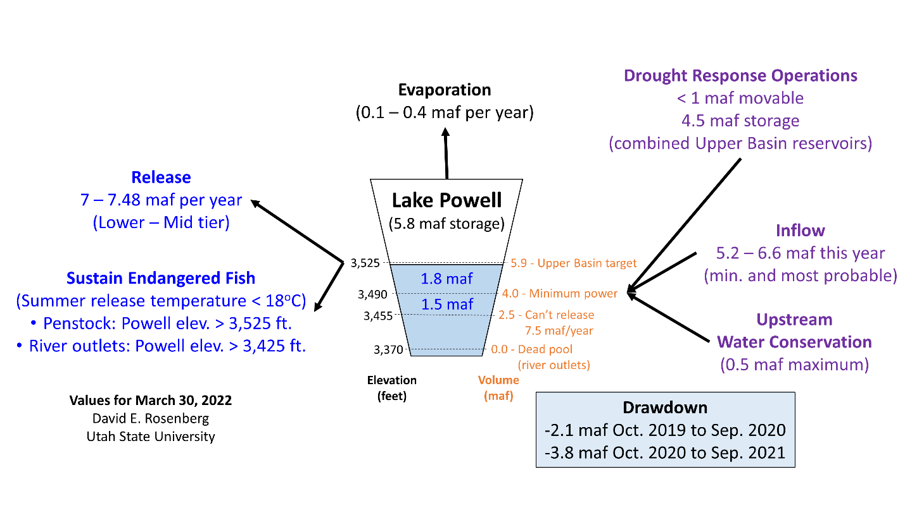

## Protect Lake Powell in brief: Coordinated actions to help generate electricity, supply water, and sustain endangered fish of the Grand Canyon

## **Introduction**

There is still opportunity to protect Lake Powell’s minimum power pool elevation
of 3,490 feet (4.0 million acre-feet [maf] storage) even though current storage
is \~5.8 maf and last year the reservoir drew down 3.8 maf.

## Data Assembly

Figure 1 assembles the data for Lake Powell drought response operations,
scenarios of annual inflow, upstream water conservation, Lake Powell
evaporation, Lake Powell releases by the mid and lower equalization tiers, and
water release temperatures to sustain the status quo for endangered fish of the
Grand Canyon (see Data Methods and Sources). Figure 1 also shows Lake Powell
drawdown for the prior 2 years and storage remaining to draw down to the minimum
power pool and elevation where the dam no longer can release 8.3 maf per year
through its outlets and meet downstream water delivery targets.

**Figure 1. Factors that affect Lake Powell storage.**

## Suggestions to Slow Reservoir Drawdown

Colorado River managers still control **Lake Powell releases** and **upstream
water conservation**.

The insight from the data assembly is that managers from the Upper and Lower
Colorado River Basins and First Nations can *together* (a) **decrease Lake
Powell releases** and (b) **increase upstream water conservation** to slow
reservoir drawdown to elevation 3,490 feet better than any party acting solo.
These coordinated actions can help to continue to generate electricity for rural
communities across 7 western U.S. states, supply downstream water users, and
sustain endangered, native fish of the Grand Canyon. We ask: how to improve this
brief? And how to make more actionable the coordinated suggestions to decrease
Lake Powell releases and increase upstream water conservation?

## Requested Feedback

Please email feedback to improve this brief and make more actionable the
coordinated suggestions to decrease Lake Powell releases and increase upstream
water conservation to [david.rosenberg@usu.edu](mailto:david.rosenberg@usu.edu).
Use the subject line **Protect Lake Powell in Brief**. Feedback will be accepted
up until April 30, 2022. We invite people who contribute feedback that improves
the brief to join as a co-author. On May 1, 2022, the brief will be re-formatted
and submitted for publication in a high-quality peer-reviewed journal.

## Current Authors

David E. Rosenberg, Utah State University.

## Data Methods and Sources

| **Component**               | **Method(s)**                                                                                                                                                                                                                                                                                                                                                                                                                                                                                                                                                                                                                                                                                                                                                                                                                                                                                                                        | **Reference**                                                                       |
|-----------------------------|--------------------------------------------------------------------------------------------------------------------------------------------------------------------------------------------------------------------------------------------------------------------------------------------------------------------------------------------------------------------------------------------------------------------------------------------------------------------------------------------------------------------------------------------------------------------------------------------------------------------------------------------------------------------------------------------------------------------------------------------------------------------------------------------------------------------------------------------------------------------------------------------------------------------------------------|-------------------------------------------------------------------------------------|
| Drought response operations | One-time release of water storage from Upper Colorado River reservoirs such as Flaming Gorge to prop up Lake Powell.                                                                                                                                                                                                                                                                                                                                                                                                                                                                                                                                                                                                                                                                                                                                                                                                                 | Attachment A1 of USBR (2019)                                                        |
| Inflow                      | Two inflow scenarios for the current hydrologic year forecast as statistical measures of the minimum and most probable inflows over the past 30 years. Inflow this year may be worse because with aridification the next 30 years may be drier than the past 30 years.                                                                                                                                                                                                                                                                                                                                                                                                                                                                                                                                                                                                                                                               | USBR (2021)                                                                         |
| Upstream water conservation | Maximum volume of water conservation listed for the Upper Basin demand management plan. Require farmers and ranchers who take payments to fallow to invest the money in farm water conservation. These investments will keep money in the local community and deliver more conserved water in future years.                                                                                                                                                                                                                                                                                                                                                                                                                                                                                                                                                                                                                          | Attachment A2 of USBR (2019); Rosenberg (2021b)                                     |
| Evaporation                 | Reservoir evaporation from current active storage to dead pool (zero active storage) and evaporation rates of 4.9 to 6.5 feet per year. Lake Powell evaporation rates have not been measured in decades. Annual evaporation volume is the product of the reservoir area and evaporation rate. Reservoir area is estimated from the reservoir storage-area curve in the Colorado River Simulation System model.                                                                                                                                                                                                                                                                                                                                                                                                                                                                                                                       | (Rosenberg, 2021a; Schmidt et al., 2016; Wheeler et al., 2019; Zagona et al., 2001) |
| Release                     | Release is specified in the 2007 Interim Guidelines. 7 maf per year is the lowest release specified in the guidelines and occurs when Lake Powell elevation is below 3,525 feet (low tier). A 7.48 maf release occurs when Lake Powell’s elevation is above 3,525 and below 3,575 feet and Lake Mead’s storage volume is higher than Lake Powell. See Wheeler et al. (2019; Figure 15) for a diagram of these operations. In Fall 2021, Lake Powell storage was above 3,525 feet (mid tier) and triggered a current year release of 7.48 maf. Presently, Lake Powell is below 3,525 feet (low tier) and may release 7 maf next year. There is also discussion to lower this year’s release to 7 maf.                                                                                                                                                                                                                                 | USBR (2007)                                                                         |
| Sustain Endangered Fish     | It is thought that summertime Lake Powell release temperatures below 18oC can sustain native, endangered fish populations of the Grand Canyon from predation by non-native fish. Using release temperature data through the penstocks and lake temperature profiles at nearby Wahweap, Lake Powell is thought to release 18oC water when it draws down to 3,525 feet and water is released through the hydropower penstocks. Or when Lake Powell draws down to 3,425 feet and water is released through the river outlets. The 18oC water temperature criteria does not include the entrainment of non-native fish that live in reservoir and their passage through the penstocks. In the lower Grand Canyon, native fish populations are presently doing well. This success is thought to be because Lake Mead storage is low and the Pierce Rapid blocks passage of non-native fish from the lake upstream to the Colorado River.  | Sidebar 1 and Appendix II in Wheeler et al. (2021)                                  |
| Reservoir Storage           | Reservoir storage is related to reservoir elevation using the elevation-storage relationship in the Colorado River Simulation System model.                                                                                                                                                                                                                                                                                                                                                                                                                                                                                                                                                                                                                                                                                                                                                                                          | (Wheeler et al., 2021; Zagona et al., 2001)                                         |
| Change in reservoir storage | Monthly Lake Powell operations data were downloaded and filtered on the month of October (water year). Values in adjacent rows were subtracted to obtain the annual change in storage.                                                                                                                                                                                                                                                                                                                                                                                                                                                                                                                                                                                                                                                                                                                                               | USBR (2022)                                                                         |

## Remaining tasks

1.  Update with new storage-elevation curve for Lake Powell that was released a
    few weeks ago.

2.  Share code to calculate change in reservoir storage.

3.  Verify river outlet capacity in figure against data in Colorado River
    Simulation System model.

## Folder Contents

-   [**PowellInBrief-DecreaseReleasesIncreaseInflowsToProtectPowerSupplyFish.docx**](https://github.com/dzeke/ColoradoRiverCoding/raw/main/ProtectPowellInBrief/ProtectPowellInBrief-CoordinatedActionsToHelpGeneratePowerDeliverWaterSustainNativeFish.docx)
    – Word source file for the brief.

-   [**PowellInBrief-DecreaseReleasesIncreaseInflowsToProtectPowerSupplyFish.md**](https://github.com/dzeke/ColoradoRiverCoding/blob/main/ProtectPowellInBrief/ProtectPowellInBrief-CoordinatedActionsToHelpGeneratePowerDeliverWaterSustainNativeFish.md)
    – Markdown version of Word doc for viewing on Github.

-   [**LakePowell04-08-2022T11.32.01.csv**](https://github.com/dzeke/ColoradoRiverCoding/raw/main/ProtectPowellInBrief/LAKEPOWELL04-08-2022T11.32.01.csv)
    – Monthly Lake Powell operations data downloaded from (USBR, 2022).

-   [**PowellBypass.xlsx**](https://github.com/dzeke/ColoradoRiverCoding/raw/main/ProtectPowellInBrief/PowellBypass.xlsx)
    – Lake Powell bypass elevation-capacity curve downloaded from the Colorado
    River Simulation System model.

-   [**ProtectLakePowellInBrief-DataAssembly.pptx**](https://github.com/dzeke/ColoradoRiverCoding/raw/main/ProtectPowellInBrief/ProtectLakePowellInBrief-DataAssembly.pptx)
    – Powerpoint source file for data assembly in Figure 1.

-   [**ProtectLakePowellInBrief-DataAssembly.png**](https://github.com/dzeke/ColoradoRiverCoding/raw/main/ProtectPowellInBrief/ProtectLakePowellInBrief-DataAssembly.png)
    – PNG version of Figure 1.

## References

Rosenberg, D. E. (2021a). "Colorado River Coding: Reservoir Evaporation."
EvapCalcs folder. <https://doi.org/10.5281/zenodo.5501466>.

Rosenberg, D. E. (2021b). "Invest in Farm Water Conservation to Curtail Buy and
Dry." *Submitted to Journal of Water Resources Planning and Management*, 3.
<https://digitalcommons.usu.edu/water_pubs/169/>.

Schmidt, J. C., Kraft, M., Tuzlak, D., and Walker, A. (2016). "Fill Mead First:
a technical assessment." Utah State University, Logan, Utah.
<https://qcnr.usu.edu/wats/colorado_river_studies/files/documents/Fill_Mead_First_Analysis.pdf>.

USBR. (2007). "Record of Decision: Colorado River Interim Guidelines for Lower
Basin Shortages and Coordinated Operations for Lakes Powell and Mead." U.S.
Bureau of Reclamation.
<https://www.usbr.gov/lc/region/programs/strategies/RecordofDecision.pdf>.

USBR. (2019). "Agreement Concerning Colorado River Drought Contingency
Management and Operations." U.S. Bureau of Reclamation, Washington, DC.
<https://www.usbr.gov/dcp/finaldocs.html>.

USBR. (2021). "Glen Canyon Dam, Current Status, Lake Powell Inflow Forecast."
U.S. Bureau of Reclamation. <https://www.usbr.gov/uc/water/crsp/cs/gcd.html>.

USBR. (2022). "Water Operations: Historic Data, Upper Colorado River Division."
Upper Colorado River Division, U.S. Buruea of Reclamation.
<https://www.usbr.gov/rsvrWater/HistoricalApp.html>. [Accessed on: June 16,
2020].

Wheeler, K., Kuhn, E., Bruckerhoff, L., Udall, B., Wang, J., Gilbert, L.,
Goeking, S., Kasprak, A., Mihalevich, B., Neilson, B., Salehabadi, H., and
Schmidt, J. C. (2021). "Alternative Management Paradigms for the Future of the
Colorado and Green Rivers." Center for Colorado River Studies, Utah State
University, Logan, Utah.
<https://qcnr.usu.edu/coloradoriver/files/WhitePaper_6.pdf>.

Wheeler, K. G., Schmidt, J. C., and Rosenberg, D. E. (2019). "Water Resource
Modelling of the Colorado River – Present and Future Strategies." Center for
Colorado River Studies, Utah State University, Logan, Utah.
<https://qcnr.usu.edu/coloradoriver/files/WhitePaper2.pdf>.

Zagona, E. A., Fulp, T. J., Shane, R., Magee, T., and Goranflo, H. M. (2001).
"Riverware: A Generalized Tool for Complex Reservoir System Modeling." *JAWRA
Journal of the American Water Resources Association*, 37(4), 913-929.
<https://onlinelibrary.wiley.com/doi/abs/10.1111/j.1752-1688.2001.tb05522.x>.
